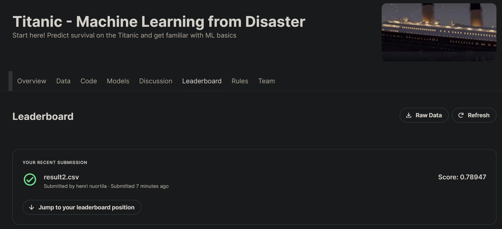

**Binary classification for the Kaggle Titanic dataset with Tensorflow**

Using data about titanic passangers for building a prediction model on survival.
Entry to the [Titanic Kaggle competiton](https://www.kaggle.com/competitions/titanic).



This model had 78.947% accuracy. Current position: 1_744 / 16_069

Install requirements:

```
$ python3.10 -m pip install -r requirements.txt
```

File model_nn.ipynb shows a test of the model using split training data, builds a model using whole training data and running the file creates results.csv with the predictions based on the test data.